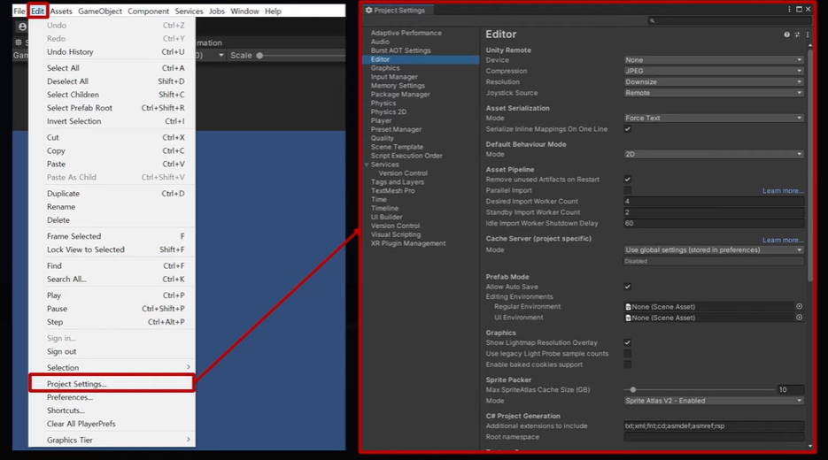

# 유니티 기초

## 게임 엔진의 주요 기능

### 그래픽 사용자 인터페이스 (Graphical User Interface, GUI)
- 개발자가 게임 개발을 위해 사용하는 게임 엔진을 좀 더 쉽게 제어할 수 있도록 그래픽 기반의 사용자 인터페이스 제공

### 그래픽스 (Graphics), 렌터링 (Rendering)
- 2D 이미지, 3D 모델 (애니메이션)을 화면에 출력하는 렌더링 과정
- 게임의 장면 표현에 필요한 여러 그래픽 요소 구현
  - 텍스처 매핑, 범프 매핑, 조명 그림자, 반사, 투명, 셰이딩

### 물리 (Physics)
- 게임 내에 존재하는 오브젝트가 물리적인 영향을 받았을 때에 대한 처리
  - 중력의 영향으로 떨어지거나 무언가에 부딪혔을 때의 처리 등

### 다중 플랫폼 (Multi Platform)
- 코드에 약간의 수정 또는 수정 없이 게임 콘솔과 PC, Mobile 등 다양한 플랫폼에서 실행 가능하도록 도와주는 기능

### 오디오 (Audio)
- 게임에서 사용되는 BGM, 효과음을 재생
- 실시간 믹싱 및 마스터링, 믹서 계층 구조, 스냅샷 등의 다양한 사운드 라이브러리를 사용할 수 있게 제공

### 인공지능 (Artificial Intelligence)
- 게임에 사용되는 여러 인공지능 라이브러리를 제공
  - 유한 상태 기계(FSM), 경로 탐색, 장애물 회피, 지형 분석, 트리거 시스템 등

### 유니티 엔진 (Unity Engine)
- 유니티 허브 (Unity Hub) : 유니티 에디터 버전 관리 프로그램
- 유니티 에디터 (Unity Editor) : 유니티 게임 개발 소프트웨어
- 유니티를 사용하기 위해 라이선스를 추가 하고 확인을 받아야 한다.

### 유니티 에디터 (Unity Editor)
- 장기 지원 (LTS, Long Term Support) 버전은 가장 안정된 버전으로 실제 개발을 진행한다면 해당 버전을 설치하는 것이 좋다. 
- 사전 릴리스 : 알파, 베타 버전 등이 존재
- 설치하기 전 빌드를 하기 위한 추가 확장팩을 설정하여 같이 설치해야한다.

## 유니티 인터페이스

### 프로젝트 생성

### Built-in Render Pipeline
- 유니티의 기본 (default) 렌더 파이프라인으로 포워드 렌더링 패스 (forward rendering path)와 디퍼드 렌더링 패스 (deferred rendering path) 중 한 가지를 선택할 수 있으며, 커맨드 버퍼와 콜백으로 기능 확장 가능

### URP (Universal Render Pipeline)
- 유니티에서 제작한 사전 빌드 된 스크립터블 렌더 파이프라인(SPP)
- URP는 아티스트 친화적 워크플로를 통해 모바일, 고사양 콘솔, PC 등 다양한 플랫폼에서 최적화된 그래픽스를 쉽고 빠르게 구현하도록 도와준다.
- 기존의 LWRP가 2019.3 버전부터 URP로 대체 되었다.

### HDRP (High Definition Render Pipeline)
- 유니티에서 제작한 사전 빌드된 스크립터블 렌더 파이프라인(SRP) 입니다.
- HDRP를 사용하면 고사양 플랫폼을 위한 최신 고해상도 그래픽스를 구현할 수 있다

### 유니티 에디터 GUI
- 메뉴 (Menu), 툴바 (Toolbar), 뷰 (View) 영역이 존재하는 에디터

- 에디터 상단에 있는 File, Edit, Assets, GameObject, Componet와 같은 메뉴

### File
- 프로젝트 or 씬 (Scene) 생성 / 저장, 프로젝트를 빌드하여 외부로 보냄 (exe, apk 등)
  

### Edit
- 현재 프로젝트의 여러 옵션 설정 (단축키, 그래픽, 오디오, 물리 등)

### Assets
- 프로젝트에 사용되는 각종 파일 생성, 패키지 파일 생성 및 불러오기

### GameObject
- 게임 내 오브젝트 생성 (빈 오브젝트, 카메라, 조명, 2D/3D 오브젝트 등)

### Component
- 게임 오브젝트에 부착되는 속성 (물리, 중력, 충돌 박스, 오디오 등)

### Window
- Asset Store, Package Manger를 포함한 다양한 View 열기

### Help
- Unity 정보, 라이선스, 레퍼런스 도움말 등

### 툴바 (Toolbar)

### 뷰 (View)

- 뷰 이름이 있는 곳을 드래그 드롭아웃을 해서 위치를 마음대로 바꿀 수 있다

### Scene View (단축키 : Ctrl + '1')
- 현재 씬(Scene)에 존재하는 모든 게임 오브젝트를 그래픽으로 표현
- 오브젝트의 위치, 크기, 회전 값을 조절할 수 있는 개발자 전용 편집 View

### Game View (단축키 : Ctrl + '2')
- 카메라 게임 오브젝트에 보이는 화면을 출력 (실제 게임화면)
  

### Inspector View (단축키: : Ctrl + '3')
- Scene View, Hierachy View 에서 선택한 게임 오브젝트나 Project View 에서 선택한 에셋 (Asset)의 세부 정보 출력

### Hierarchy View (단축키 : Ctrl + '4')
- 현재 씬 (Scene)에 존재하는 모든 게임 오브젝트를 이름으로 표현
  - 이름으로 보이기 때문에 Scene View 보다 게임 오브젝트 관리가 용이하다
  - 게임 오브젝트들 간의 계층구조 (부모-자식)를 설정 및 확인할 수 있다.
  

- 부모-자식 관계에 있을 때 오브젝트 제어

### Project View (단축키 : Ctrl + '5')
- 현재 프로젝트에 필요한 모든 리소스 관리
  - 유니티에서 리소스를 Asset이라고 한다
  - Audio, Image, 3D Model, 동영상 등

### 유니티 Asset File Format
- Image Files
  - bmp, tif, tga, jpg, psd와 같이 가장 일반적인 이미지 파일 형식을 지원
  - 포토샵(*.psd)파일을 "Assets 폴더"에 저장하면 병합된 이미지로 가져옴

- 3D Model, Animation Files
  - 가장 일반적인 3D 소프트웨어의 기본 파일 (*.max, *.blend, *.mb, *.ma, etc...)을 "Assets 폴더"에 저장하면 유니티에서 새로 로드해서 저장하게 된다
  - 대부분의 3D 소프트웨어에서 제작한 파일을 가져올 수 있다 (호환성 문제로 폴리곤 정보는 유지되지만 맵핑 정보는 유지되지 않는 경우가 많다)
  - 가장 호환성이 좋은 파일 포맷은 *.fbx

- Audio Files
  - 오디오 파일을 "Assets 폴더"에 저장하면 지정된 압축 설정에 따라 가져옴

- 유니티의 Assets 폴더로 들어온 에셋은 압축, 수정 또는 처리하는 다양한 방법에 따라 변형되어 사용한다 (유니티 내부에서만 변형되고, 원본 자체가 변형되진 않음)

### Consile View (단축키 : Ctrl + Shift + 'C')
- 게임에 필요한 여러 정보, 작성한 소스 코드에서 발생한 경고나 에러 출력

## 기본 용어

### 프로젝트 (Project)
- 하나의 게임, 콘텐츠, 어플리케이션을 뜻한다

### 씬 (Scene)
- 게임의 장면이나 상태를 저장하는 단위
- 하나의 거대한 게임을 씬 단위로 관리하며, 코드를 이용해 씬 이동이 가능하다
- ex) Intro Scene, Menu Scene, Stage 1 ~ N Scene, GameOver Scene, Ending Scene, Etc.

## 게임 오브젝트 (GameObject)
- 씬이 배치되는 하나의 객체를 지정하는 단위
  - 게임 오브젝트는 컴포넌트를 묶어서 관리하고, 관리하는 컴포넌트에 접근할 수 있는 수단
  - 모든 게임 오브젝트는 위치/회전/크기를 제어하는 "Transform" 컴포넌트를 가지고 있다.

- 게임 오브젝트에 원하는 컴포넌트를 추가하여 다양한 오브젝트 제작 가능
  - ex) 적 오브젝트, 나무 오브젝트, 공격 효과음 오브젝트, 불 이펙트 오브젝트 등

### 컴포넌트(Componenet) [C# Script]
- 게임 오브젝트에 부착할 수 있는 C# 스크립트 파일을 지칭하는 단위
- 게임 오브젝트에 컴포넌트를 부착하여 게임 오브젝트에 여러 기능을 부여

### 에셋 (Asset)
- 프로젝트 내부에서 사용하는 모든 리소스를 지칭하는 단위 (Project View)
- Audio, 3D Model, Animation, Texture, Script, Prefab, Etc...

### 프리팹 (Prefab)
- Hierarchy View에 있는 게임 오브젝트를 파일 형태로 저장하는 단위
- 주로 게임 중간에 생성되는 게임 오브젝트를 프리팹으로 저장해두고 사용한다
- 프리팹의 장점
  - 동일한 게임 오브젝트를 여러 씬이나 게임 월드 특정 장소에 배치할 때 Project View에 저장되어 있는 프리팹을 Drag&Drop하여 배치할 수 있다
  - 기획상의 변경이 있을 떄 프리팹 원본을 갱신하게 되면 모든 씬에 배치되어 있는 게임 오브젝트들도 원본과 동일하게 업데이트 된다

### Project, Scene, GameObject, Component, Asset 관계도

### Unity 좌표 체계
- Unity의 게임 월드는 왼손 좌표계를 기준으로 x, y, z 축을 나타낼 수 있다

## 게임 오브젝트, 컴포넌트

### 게임 오브젝트 메뉴
- 많이 사용되는 게임 오브젝트들을 쉽게 생성할 수 있도록 메뉴로 제공

### 빈 오브젝트 (Empty Object)
- Transform 컴포넌트만 가지고 있는 빈 게임 오브젝트 생성

### 2D Object
- 게임 화면에 2D 이미지를 출력하거나 출력 효과를 제어하는 2D 오브젝트

### Sprite 오브젝트 [2D Object - Sprites]
- 게임 화면에 2D 이미지를 출력하는 게임 오브젝트

### Sprite Mask 오브젝트 [2D Object - Sprite Mask]
- SpriteMask 오브젝트 위치에 Sprite 오브젝트가 배치될 경우 SpriteMask 오브젝트의 Sprite에 설정된 모양, 크기에 따라 Sprite 오브젝트의 특정 부분이 보이거나 보이지 않는다.

### Sprite 오브젝트 [2D Object - Physics]
- 기존 Sprites 메뉴의 오브젝트에 물리가 추가된 게임 오브젝트

- 기본 스프라이트 2D에 콜라이더와 Rigidbody가 추가된 오브젝트
- 스프라이트 오브젝트를 생성하고 직접 컴포넌트를 추가해도 된다

### Sprite Shape [2D Object - Sprite Shape]
- 굴곡이 있는 바닥이나 내부가 채워진 2D 이미지를 보이게 하는 게임 오브젝트

- Open Shape와 Close Shape

- Sprite Shape Profile Asset
  - Project View - "+" - 2D - Sprite Shape Profile
  

- Sprite Shape Profile Asset의 Sprites에 등록하는 이미지 설정 (Open Shape)

- Sprite Shape Profile Asset의 Sprites에 이미지 등록 (Open Shape)
  

- Open Shape 오브젝트에 Profile 등록 및 설정

- Open Shape 오브젝트에 Profile 등록 및 설정

- Sprite Shape Profile Asset의 Fill - Texture에 등록하는 이미지 설정 (Close Shape)

- Sprite Shape Profile Asset의 Fill - Texture에 이미지 등록 (Close Shape)

- Close Shape 오브젝트에 Profile 등록 및 설정
  

- Game View에서 본 Open Shape와 Close Shape 오브젝트

### 3D Object
- 게임 화면에 배치할 수 있는 3D 오브젝트

### 3D Object (예시는 Cube 오브젝트)

### 3D Object - Cube
- 한 변의 길이가 1이고, 6개의 면으로 이루어진 육면체
- 텍스처를 적용하면 모든 면에 동일한 이미지가 표현된다

- 2D 오브젝트의 이미지(색상) 설정

- 3D 오브젝트의 이미지(색상) 설정
  

- 3D 오브젝트의 Material에 등록하는 이미지 에셋 설정

### 3D Object - Sphere
- 직경이 1이고, 둥근 형태의 구체
- 텍스처를 적용하면 하나의 이미지를 구 전체에 감싸는 것처럼 표현된다

### 3D Object - Capsule
- 직경이 1 높이가 2이고, 원기둥에 반구 모양의 캡을 상하로 덮은 모양
- 텍스처를 적용하면 하나의 이미지를 전체에 감싸는 것처럼 표현된다 (구와 흡사)

### 3D Object - Cylinder
- 직경이 1 높이가 2인 원기둥
- 텍스처를 적용하면 상하 둥근 면에 하나씩, 튜브 모양의 바디에 감싸져서 표현된다

### 3D Object - Plane
- Transform - Scale이 1일 경우 XZ 평면의 크기가 10 단위인 사각 형태의 평면
- 텍스처를 적옹하면 plane 전체에 하나의 이미지가 표현된다

### 3D Object - Quad
- 한 변의 길이가 1인 사각 형태의 평면
- 텍스처를 적용하면 Quad 전체에 하나의 이미지가 표현된다

### Effects
- 게임에 보여지는 여러 효과, 무기의 잔상, 선 그리기와 같은 오브젝트들

### Effects - Particle System
- 게임에 보여지는 다양한 효과를 제작하는 게임 오브젝트

### Effects - Trail
- 무기를 휘두르거나 객체가 이동할 때 잔상 효과를 그려주는 게임 오브젝트

### Effects - Line
- 선을 그려주는 게임 오브젝트

### Audio
- 게임 내에서 재생되는 사운드와 관련된 오브젝트들
  

### Audio - Audio Source
- AudioClip에 등록된 사운드를 재생하는 게임 오브젝트

### Video
- 동영상을 재생하는 게임 오브젝트

### Video - Video Player
- VideoClip에 등록된 동영상을 재생하는 게임 오브젝트

### UI
- 사용자가 게임과 상호작용 할 수 있는 UGUI 오브젝트들

### UI Toolkit
- UI Builder, UI Debugger와 같은 전용 제작 도구를 이용한 UI 제작

