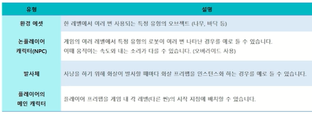

# 게임 인터페이스의 이해

## 오브젝트의 활용법

### 에셋 스토어

- 정의
  - 유니티 엔진에서 사용할 수 있는 3D, 2D, 음향, 스크립트 등의 파일들을 판매하는 상점
  - https://assetstore.unity.com/ko?locale=ko-KR

### 프리팹 (Prefab)

- 정의
  - 재사용 가능한 에셋
  - 게임 오브젝트의 모든 컴포넌트, 프로퍼티 값, 자식 게임 오브젝트를 재사용 가능한 에셋으로 생성 가능

- 사용 예시



- 생성 방법
  - 씬 뷰 혹은 하이어라키 뷰에서 만든 게임 오브젝트를 프로젝트 뷰로 드래그앤 드랍으로 생성 가능
  - 파란색으로 생성


## Canvas의 이해

### Canvas란?

- 정의
  - 캔버스는 Canvas 컴포넌트가 있는 게임 오브젝트
  - 모든 UI 요소는 반드시 어떤 캔버스의 자식이어야 함 (계층 구조로 이루어짐)


- Render Mode
  - 스크린 공간 또는 월드 공간에 렌더링하도록 하기 위해 사용되는 모드 설정


- Screen Space - Overlay : 스크린 상에서 고정되어 나타나는 UI를 활용할 때 사용
  - 예) 옵션 선택, 나가기 버튼
  - 카메라를 움직이거나 플레이어가 이동하더라도 그 공간 안에 유지되어 있다

- Screen Space - Camera : 메인 카메라에 계속해서 붙어다니는 UI
  - 메인 카메라가 전환이 되더라도 메인 카메라의 뷰에 따라서 옮겨 다니는 UI
  - Overlay와 가장 큰 차이점은 Overlay의 경우 반드시 3D 오브젝트의 위쪽으로 배치가 되어야 한다 / 카메라의 경우 뒤쪽으로 배치할 수 있다

- World Space : 3차원 형태의 UI를 만들 때 사용한다
  - 예) 닉네임, 이미지 등

- 캔버스가 반드시 씬에 하나만 있는 것이 아닌 경우에 따라 여러 개가 생성이 가능하다

## UI의 이해

### 사각 트랜스폼

- Rect Transform
  - UI 요소를 안에 넣을 수 있는 사각형
  - 사각 트랜스폼의 상위 컴포넌트도 사각 트랜스폼인 경우, 하위 사각 트랜스폼이 상위 사각형에 대한 상대적인 포지션과 크기 지정 가능


- 해상도에 따른 UI 위치변경을 방지하기 위해 Rect Transform을 활용한다


### UI 종류

- Image : 스프라이트(Sprite) 타입의 이미지를 적용
- Text : 레이블이라고도 하며 표시할 텍스트를 입력함 (Text는 사용 중지 / Text Mesh Pro를 사용)
- Panel : UI를 그룹화할 때 사용
- Toggle : 켜짐 / 꺼짐 중 상태를 결정
- Slider : 최소값에서 최대값까지 드래그할 수 있는 숫자 값
- Scrollbar : 0 ~ 1 사이의 값을 드래그 가능
- Scroll View : 콘텐츠를 스크롤 하는 기능
- Button : 사용자의 클릭에 반응하고, 액션을 시작하거나 확인

### Button

- Button 사용 방법
  - 이벤트 스크립트 생성 후 OnClic() 필드에 이벤트가 있는 스크립트 함수 연결


## 씬 전환하기

### 씬 전환 예제
- 씬 전환을 위해 새로운 씬 생성 후 버튼 생성
- 전환할 씬 생성 후 이름을 "Scene2"로 변경

- 스크립트 작성
  - 씬 전환을 위해 네임 스페이스 필요 (UnityEngine.SceneManagement)
  
- 하이어라키 오브젝트 스크립트 할당 후 버튼의 OnClick()에 함수 연결

```C#
using System.Collections;
using System.Collections.Generic;
using UnityEngine;
using UnityEngine.SceneManagement;

public class ChangeScene : MonoBehaviour
{
    public void SceneTransition()
    {
        SceneManager.LoadScene("Scene2");
    }
}
```

- 유니티가 함수에 접근하기 위해 public으로 함수 선언
  


- File > BuildSettings의 Scenes in Build에 씬 두 개 추가
- 버튼 클릭 시 씬 전환 확인

