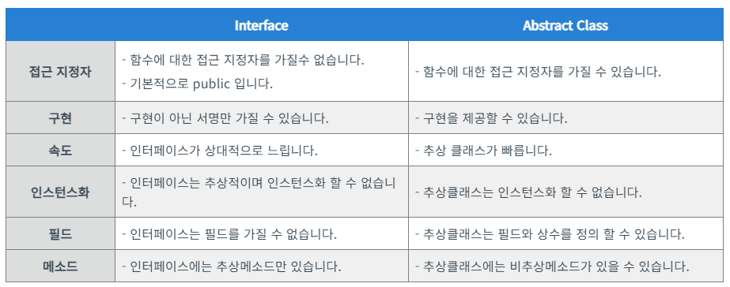

# Interface

## Interface vs Abstract Class

- C#에서 클래스는 하나 이상의 인터페이스를 상속
- 그러나 클래스는 하나의 추상클래스만 상속할 수 있다

- C#에서 인터페이스는 생성자를 선언할 수 없다
- 추상 클래스는 생성자를 선언할 수 있다

- C#에서 인터페이스는 클래스의 외부 능력을 정의하는데 사용
- 추상 클래스는 클래스의 실제 ID를 정의하는 데 사용되며 객체 또는 동일한 유형으로 사용

- C# 에서 다양한 구현이 메소드 서명만 공유하는 경우 인터페이스가 사용된다
- 다양한 구현이 동일한 종류이고 동일한 동작 또는 상태를 사용하는 경우 추상 클래스가 사용된다

- C#에서 새 메소드가 인터페이서에 추가 된 경우 모든 인터페이스가 구현 된 위치를 추적하고 해당 메소드의 구현도 추가해야 한다
- 추상 클래스에서 새 메소드가 추가 된 경우 기본 구현을 추가 할 수 있는 옵션이 있으므로 모든 기존 코드가 올바르게 작동한다