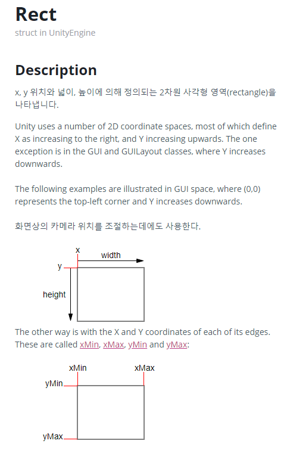

# Rect

## Rect

- RectTransform은 Rect를 가진다
- 호출한 오브젝트의 2D 사각형 정보를 `Rect` 로 자져온다
  - 2D 사각형으로서의 넓이, 높이 등등의 정보가 담겨 있다
- UI의 가로, 세로 등등의 정보를 알고자 할 때 사용된다
- 왼쪽 상단을 x, y 시작점으로 한다
  - x 는 👉 방향으로 +
  - y 는 👇 방향으로 +

- `xMin`은 앵커(원점)을 기준으로 `width/2` 만큼 왼쪽으로 떨어진 곳의 x 좌표 라고 할 수 있다
  - 원점이 중앙이라면 `xMin`은 음수가 된다
- `xMax`은 앵커(원점)을 기준으로 `width/2` 만큼 오른쪽으로 떨어진 곳의 x 좌표라고 할 수 있다
- `yMin`은 앵커(원점)을 기준으로 `height/2` 만큼 위쪽으로 떨어진 곳의 y 좌표라고 할 수 있다
  - 원점이 중앙이라면 `yMin`은 음수가 된다
- `yMax`은 앵커(원점)을 기준으로 `height/2` 만큼 아래쪽으로 떨어진 곳의 x 좌표라고 할 수 있다

## RectTransform
- RectTransform 도 Transform 을 상속 받는다
  - 그래서 UI 오브젝트들도 `go.transform`을 통해 RectTransform을 가져올 수 있다